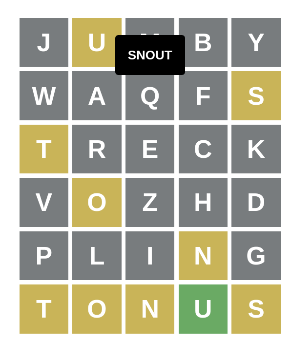

# Solve Wordle the Interesting Way

### Wordle Solving Method

Make 5, 5-letter guesses,
where 25 different letters appear.
Leave out 'Z', 'J', 'B' or 'Q'.

Based on the letters remaining, solve the Wordle puzzle.

---

## Are there 5, 5-letter words that contain 25 distinct letters?

This repo attempts to solve that problem.

## Dictionary of 5-letter words

Under Arch Linux, relatively up-to-date on 2022-03-27,
`/usr/share/dict/words` is a symbolic link to
`/usr/share/dict/american-english`.
`/usr/share/dict/american-english` is owned by package "words 2.1-6".


```sh
tr -cd '[A-Za-z\n]' < /usr/share/dict/words | tr '[A-Z]' '[a-z]' |
grep '^.....$' | sort | uniq > words.5
```
7393 unique 5-letter words exist in that dictionary.
Some of these words have duplicate letters ("teeth"),
some don't make sense: this dictionary has common Roman Numeral strings,
like "clxiv",
because this dictionary is intended for use in spell checking.
Why alert on Roman Numerals used to denote page order of introductions?

This dictionary is different than the dictionary used internally by
the Wordle JavaScript app.

## Build and Run

```sh
$ go build a1.go
$ ./a1 -i dictionary_file
Found 8322 5-letter words
Made 5182 unique-key words
word: abhor
word: abide
...
guess "abcdefghiklmnopqrstuvwxyz": bemix waqfs clunk vozhd grypt
...
```

Output is on stdout.

There is a `-D` flag that will use 5-letter dictionary words that have
duplicate letters ("popes" has 2 'p' letters).
This means that any set-of-5-words it finds contain less than 25 unique letters.

## Design

* [First cut](main.go), slow and inefficient
* [Second cut](a1.go), much faster

My second cut is a better program.
The basic method is to have a "current guess" that includes a list of
up to 5 words,
a "scoreboard" of the letters used by words 1 through 4,
and a Go map.

The map is keyed by 5-letter-strings,
comprising alphabetized letters of a dictionary word.
The dictionary word "cable" would have its letters alphabetized as "abcle".
"abcle" would be a key in the map for the value "cable".
The code walks a slice of all the 5-letter,
lowercase words without duplicate letters.
Starting with some word, "tacks" for example,
the program marks 't', 'a', 'c', 'k' and 's' as used in the scoreboard,
then composes all 5-letter strings that don't use letters marked in the scoreboard.
Since 'a' is used, the program would start with 'b'.
Since 'c' is used, the program would use 'd', 'e', 'f' and 'g' as the next letters
in a key.
Since no words match the key "bdefg", the program would try keys "bdefh", "bdefi",
"bdefj", ... until it finds a value in the map matching some 5-letter key.
The code saves that value, and marks its letters as used in the scoreboard.
After 5 levels of such work, the code prints a 5-word set that uses 25 letters.

## Solutions

### Using /usr/share/dict/words

```
benzs   clxiv   fjord   gawky   thump 
benzs   clxvi   fjord   gawky   thump 
bjork   clxiv   fazed   gwyns   thump 
bjork   clxvi   fazed   gwyns   thump 
bumph   frock   gyved   jinxs   waltz 
```

"clxiv" and "clxvi" are just Roman Numerals.

Wordle-the-app doesn't allow "jinxs", or the Roman Numeral strings as a guess,
so none of these sets-of-5-words would work.

### Using Wordle Dictionary

```
bemix waqfs clunk vozhd grypt
bling waqfs treck vozhd jumpy
blunk waqfs cimex vozhd grypt
brick waqfs vozhd glent jumpy
brung waqfs xylic vozhd kempt
chunk waltz vibex fjord gymps
clipt waqfs jumby vozhd kreng
fjord waltz vibex gucks nymph
glent waqfs jumby prick vozhd
jumby waqfs treck vozhd pling
```
I tried to solve a Wordle with a set-of-5 words, and failed:



Wordle-the-app will allow the 5-word set jumby-waqfs-treck-vozhd-pling,
although none of those seem like legitimate English words to me.

## Stand Up Maths

Matt Parker, of Stand Up Maths fame,
[addressed this exact problem](https://www.youtube.com/watch?v=_-AfhLQfb6w).

His example is "fjord waltz vibex gucks nymph", which my program found, see above.
I think my program is less efficient than the
[graph theory-enabled code](https://gitlab.com/bpaassen/five_clique)
one of Matt's viewers wrote,
but more efficient than Matt's code.
Not bad.
